为ok源码的前身。

连接池
拦截链
缓存机制
连接过程

---
通常这么写OkHttp请求。
```
   OkHttpClient.Builder builder = new OkHttpClient.Builder();
   builder.connectTimeout(1000, TimeUnit.MILLISECONDS);
   builder.readTimeout(1000, TimeUnit.MILLISECONDS);
   builder.writeTimeout(1000, TimeUnit.MILLISECONDS);
   HttpLoggingInterceptor interceptor = new HttpLoggingInterceptor();
   interceptor.setLevel(HttpLoggingInterceptor.Level.BODY);
   builder.addInterceptor(interceptor);
 //post的请求体 需要一个RequestBody对象，这是一个抽象类 具体子类有 FormBody 与 MultipartBody，其中MultipartBody使用比较多
   // RequestBody requestBody = RequestBody.create();
   MultipartBody.Builder multipartBody = new MultipartBody.Builder().setType(MultipartBody.FORM);
   //添加参数(普通键值对参数)
   multipartBody.addFormDataPart("", "");
   //文件、图片参数
   multipartBody.addFormDataPart("", "fileName",
   RequestBody.create(MediaType.parse("image/png"), new File("fileName")));

   //请求对象
   Request request = new Request.Builder()
   .addHeader("cookie", "10086")
   .post(multipartBody.build())
   .url("http://123456.com")
   .build();
   //异步请求
   OkHttpClient client = builder.build();
   Call call = client.newCall(request);
   call.enqueue(new Callback() {
       @Override
       public void onFailure(Call call, IOException e) {

      }

      @Override
      public void onResponse(Call call, Response response) throws IOException {

      }
   });

   //同步请求
   try {
       Response response = call.execute();
   } catch (IOException e) {
       e.printStackTrace();
   }

    }
```
下面分以下几个步骤跟踪OkHttp的请求流程:
* OkHttpClient
* Request
* Call(开始请求)
##### 第一步OkHttpClient实例：   
:进到``Request.Builder()``方法里面去：
```java
 public static final class Builder {
 public Builder() {
    Dispatcher dispatcher;
    @Nullable Proxy proxy;
    List<Protocol> protocols;
    List<ConnectionSpec> connectionSpecs;
    final List<Interceptor> interceptors = new ArrayList<>();
    final List<Interceptor> networkInterceptors = new ArrayList<>();
    EventListener.Factory eventListenerFactory;
    ProxySelector proxySelector;
    CookieJar cookieJar;
    @Nullable Cache cache;
    @Nullable InternalCache internalCache;
    SocketFactory socketFactory;
    @Nullable SSLSocketFactory sslSocketFactory;
    @Nullable CertificateChainCleaner certificateChainCleaner;
    HostnameVerifier hostnameVerifier;
    CertificatePinner certificatePinner;
    Authenticator proxyAuthenticator;
    Authenticator authenticator;
    ConnectionPool connectionPool;
    Dns dns;
    boolean followSslRedirects;
    boolean followRedirects;
    boolean retryOnConnectionFailure;
    int connectTimeout;
    int readTimeout;
    int writeTimeout;
    int pingInterval;
 }
  public Builder() {
      dispatcher = new Dispatcher(); //类的解释是说关于何时执行异步请求的策略，调度器
      protocols = DEFAULT_PROTOCOLS;
      connectionSpecs = DEFAULT_CONNECTION_SPECS;
      eventListenerFactory = EventListener.factory(EventListener.NONE);
      proxySelector = ProxySelector.getDefault();
      cookieJar = CookieJar.NO_COOKIES;
      socketFactory = SocketFactory.getDefault();
      hostnameVerifier = OkHostnameVerifier.INSTANCE;
      certificatePinner = CertificatePinner.DEFAULT;
      proxyAuthenticator = Authenticator.NONE;
      // 响应来自远程web服务器或代理服务器的身份验证挑战。实现可以通过返回一个包含的请求来满足挑战一个授权头，
      //或者通过返回null来拒绝挑战。在这种情况下未经验证的响应将返回给触发它的调用者。
      //NONE: 不知道任何凭据且不尝试进行身份验证的验证程序
      authenticator = Authenticator.NONE; 
      connectionPool = new ConnectionPool();
      dns = Dns.SYSTEM;
      followSslRedirects = true;
      followRedirects = true;
      retryOnConnectionFailure = true;
      connectTimeout = 10_000; //连接超时
      readTimeout = 10_000;  //读取超时
      writeTimeout = 10_000;  //写入超时
      pingInterval = 0; 
  }
}
```
emmm，代码贴的优点多。这个Builder类是OkHttpClient的一个静态内部类，这里应用了一种建造者模式。可以看到，这部分主要就是Builder类中的属性初始化，部分属性从命名中也可以推断出一下来。像cookieJar，
proxy(代理)、interceptors(拦截器)、readTimeout(read超时)等等。到这Builder对象已经构建，接下来后面的builder.connectTimeout(),builder.readTimeout()等等都是为相对应属性赋值。还有
``builder.addInterceptor()``里面添加的拦截器是添加到interceptors里面去的。networkInterceptors是通过与addNetworkInterceptor()添加的。关于addInterceptor()与addNetworkInterceptor(),
以后再分析两者的区别，现在主要目标是跟踪它的请求流程。对需要的属性赋值完成后，OkHttpClient的实例就算是完成了。
##### 第二步：Request请求  
先看看Request类
```
public final class Request {
  final HttpUrl url;
  final String method;
  final Headers headers;
  final @Nullable RequestBody body;
  final Object tag;
  private volatile CacheControl cacheControl; // Lazily initialized.
  
 ...下面代码省略...
 }
```
Request类内部的属性有url，请求方式，请求头，请求体以及缓存。返回到new Request.Builder(),进入到Builder()这个方法：
```
    public Builder() {
      this.method = "GET";
      this.headers = new Headers.Builder();
    }
```
以上，构建了一个Headers.Builder()实例(请求头)，默认的请求方式是get。后面的`` .addHeader("", "")``就是配置请求头信息了，添加到这个headers中去。下面是方法源码:
```
    public Builder addHeader(String name, String value) {
      headers.add(name, value);
      return this;
    }
```
后面的.post()，.url()最终就是对 Request对象内的method(请求方式)、body(请求体)、url(地址)赋值。至此，构建Request对象已经结束。
###### 第三步 Call 对象
进入到newCall(*)方法里面:
```
  @Override public Call newCall(Request request) {
    return new RealCall(this, request, false /* for web socket */);
  }
```
实际上返回的RealCall的对象。看下这个RealCall类:   
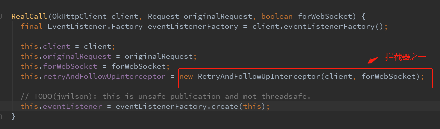    
这部分代码就是创建了一个NewCall对象，在这个对象里还初始化了一个拦截器(重定向拦截)，这个拦截器后面还会用到。到这OkHttp的准备工作
已经做好，进入正式的请求流程。
##### enqueue() 与 execute()
execute()是同步请求，enqueue()是异步请求。平时都是异步请求使用居多，所以主要跟踪异步请求流程。进到enqueue()方法中去。因为Call是一个接口
最后会到他的子类(就是RealCall)的enqueue()方法中去。RealCall的enqueue()方法：  
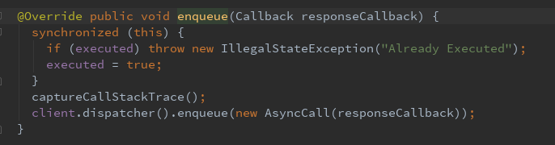     
这里直接看到最后一行(关键代码)，client.dispatcher()就是在第一步获取OkHttpClient实例中那个静态内部类Builder的一个对象。大概就是调度器的意思。
然后将我们的Callback封装成一个``AsyncCall``对象，通过Dispatcher的enqueue()方法执行:
```
  synchronized void enqueue(AsyncCall call) {
    if (runningAsyncCalls.size() < maxRequests && runningCallsForHost(call) < maxRequestsPerHost) {
      runningAsyncCalls.add(call);
      executorService().execute(call);  //立即执行
    } else {
      readyAsyncCalls.add(call);  //先添加到队列(双端)，延迟执行
    }
  }
```
这里：如果当前运行的异步请求数量小于最大请求请求数量并且正在运行的共享同一个主机的请求数量也小于最大的同主机请求数量就
马上执行这个请求。否则暂时添加到队列，后面再执行。这里最大执行中请求数量与最大同主机请求数量分别是64 跟 5：   
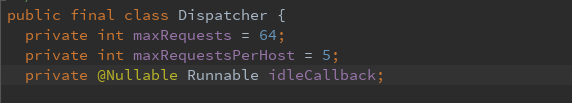  
``executorService()``返回了一个ExecutorService接口对象，实际是ThreadPoolExecutor实例，就是线程池。OK,进到ThreadPoolExecutor.execute()中去
```
    public void execute(Runnable command) {
        if (command == null)
            throw new NullPointerException();
        /*
         * Proceed in 3 steps:  //这里源码的3段注释已经给出了这部分代码的目的(可借助工具进行翻译阅读，0.0)。
         *
         * 1. If fewer than corePoolSize threads are running, try to
         * start a new thread with the given command as its first
         * task.  The call to addWorker atomically checks runState and
         * workerCount, and so prevents false alarms that would add
         * threads when it shouldn't, by returning false.
         *
         * 2. If a task can be successfully queued, then we still need
         * to double-check whether we should have added a thread
         * (because existing ones died since last checking) or that
         * the pool shut down since entry into this method. So we
         * recheck state and if necessary roll back the enqueuing if
         * stopped, or start a new thread if there are none.
         *
         * 3. If we cannot queue task, then we try to add a new
         * thread.  If it fails, we know we are shut down or saturated
         * and so reject the task.
         */
        int c = ctl.get();
        if (workerCountOf(c) < corePoolSize) {
            if (addWorker(command, true))
                return;
            c = ctl.get();
        }
        if (isRunning(c) && workQueue.offer(command)) {
            int recheck = ctl.get();
            if (! isRunning(recheck) && remove(command))
                reject(command);
            else if (workerCountOf(recheck) == 0)
                addWorker(null, false);
        }
        else if (!addWorker(command, false))
            reject(command);
    }
```
总结来讲，上边主要就是对当前这个请求任务是否能成功排队，成功执行的一些检查判断。1.当前执行中任务数量小于线程核心池线程数量，则开启线程执行任务。2.即使这个任务成
进入到队列排队也还再次检查是否需要添加一条新线程(上一次检查后有的线程已经死亡)或者是否关闭线程池()。3.如果这个任务不能进入到队列排队就试图开启一条
新线程。如果也失败了则拒绝执行这个任务。正常情况下请求任务肯定是会执行的，通过addWorker()进入到队列，执行。addWorker()方法的部分代码:  
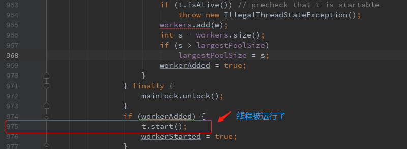     
线程被执行就会走run()方法,找到call对象的run方法。call是AsyncCall，AsyncCall类继承NamedRunnable，它本身没有run()方法，找它的父类)。
NamedRunnable类的run()方法体中调用抽象方法``execute();``，最后还是回到RealCall的execute()方法：
```
    @Override protected void execute() {
      boolean signalledCallback = false;
      try {
        Response response = getResponseWithInterceptorChain();//获取响应数据
        if (retryAndFollowUpInterceptor.isCanceled()) {
          signalledCallback = true;
          responseCallback.onFailure(RealCall.this, new IOException("Canceled")); //失败回调
        } else {
          signalledCallback = true;
          responseCallback.onResponse(RealCall.this, response);  //成功回调
        }
      } catch (IOException e) {
        if (signalledCallback) {
          // Do not signal the callback twice!
          Platform.get().log(INFO, "Callback failure for " + toLoggableString(), e);
        } else {
          responseCallback.onFailure(RealCall.this, e);
        }
      } finally {
        client.dispatcher().finished(this);
      }
    }
  }
```
这个方法结束，整个请求就结束了。？？感觉不对啊，这么优秀的框架不可能就这么分析完了啊。是的，重头戏在``getResponseWithInterceptorChain()``
这里。先在这个标记一下，进入到这个方法里面来：
```
  Response getResponseWithInterceptorChain() throws IOException {
    // Build a full stack of interceptors.
    List<Interceptor> interceptors = new ArrayList<>();
    interceptors.addAll(client.interceptors());  //我们自己添加的拦截器如：HttpLoggingInterceptor
    interceptors.add(retryAndFollowUpInterceptor); //重定向拦截器
    interceptors.add(new BridgeInterceptor(client.cookieJar()));  //桥拦截器
    interceptors.add(new CacheInterceptor(client.internalCache()));  //缓存拦截器
    interceptors.add(new ConnectInterceptor(client));  // 连接拦截器
    if (!forWebSocket) {
      interceptors.addAll(client.networkInterceptors());  //网络拦截器
    }
    interceptors.add(new CallServerInterceptor(forWebSocket));  //服务器拦截器(ps:这个名称自己叫的)

    Interceptor.Chain chain = new RealInterceptorChain(
        interceptors, null, null, null, 0, originalRequest);
    return chain.proceed(originalRequest);
  }
}
```
这个方法里面添加了一堆拦截器(留意它的添加顺序，不然后面会被绕蒙圈)，最后创建了RealInterceptorChain实例，执行它的proceed()方法。proceed()有一个重载的只有一个参数方法，
看那个多参数的方法： 
```
  public Response proceed(Request request, StreamAllocation streamAllocation, HttpCodec httpCodec,
      RealConnection connection) throws IOException {
    if (index >= interceptors.size()) throw new AssertionError();

    calls++;

    // If we already have a stream, confirm that the incoming request will use it.
    if (this.httpCodec != null && !this.connection.supportsUrl(request.url())) {
      throw new IllegalStateException("network interceptor " + interceptors.get(index - 1)
          + " must retain the same host and port");
    }

    // If we already have a stream, confirm that this is the only call to chain.proceed().
    if (this.httpCodec != null && calls > 1) {
      throw new IllegalStateException("network interceptor " + interceptors.get(index - 1)
          + " must call proceed() exactly once");
    }

    // Call the next interceptor in the chain.
    RealInterceptorChain next = new RealInterceptorChain(
        interceptors, streamAllocation, httpCodec, connection, index + 1, request);
    Interceptor interceptor = interceptors.get(index);
    Response response = interceptor.intercept(next);

    // Confirm that the next interceptor made its required call to chain.proceed().
    if (httpCodec != null && index + 1 < interceptors.size() && next.calls != 1) {
      throw new IllegalStateException("network interceptor " + interceptor
          + " must call proceed() exactly once");
    }

    // Confirm that the intercepted response isn't null.
    if (response == null) {
      throw new NullPointerException("interceptor " + interceptor + " returned null");
    }

    return response;
  }
```
方法主要做了这几件事：
> 1、判断index是否大于拦截器集合大小，大于的话则抛出异常；  
  2、接下判断connection是否是跟请求的连接是同一个；  
  3、保证这个流(httpCodec)只被使用一次；
  4、进入下一个拦截器(next对象的构造传入index + 1)；
  
第四步是这个这个方法最关键的:     
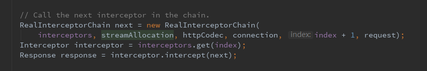  
这里创建了包含了指向下一个拦截器的index的RealInterceptorChain对象，然后取出当前的这个拦截器，执行它的intercept()方法。而且在后面的拦截器
都会重复这样的操作，直到所有的拦截器都被执行完。这里应用到了责任链模式。   
下面开始是拦截器跟踪部分：   
<b>RetryAndFollowUpInterceptor 重定向拦截器</b>
```
    @Override public Response intercept(Chain chain) throws IOException {
    //---第一部分--------------------
    Request request = chain.request();

    streamAllocation = new StreamAllocation(
        client.connectionPool(), createAddress(request.url()), callStackTrace);

    int followUpCount = 0;
    Response priorResponse = null;
    //----第二部分------------------
    while (true) {
      if (canceled) {
        streamAllocation.release();
        throw new IOException("Canceled");
      }

      Response response = null;
      boolean releaseConnection = true;
      try {
        response = ((RealInterceptorChain) chain).proceed(request, streamAllocation, null, null);
        releaseConnection = false;
      } catch (RouteException e) {
        // The attempt to connect via a route failed. The request will not have been sent.
        if (!recover(e.getLastConnectException(), false, request)) {
          throw e.getLastConnectException();
        }
        releaseConnection = false;
        continue;
      } catch (IOException e) {
        // An attempt to communicate with a server failed. The request may have been sent.
        boolean requestSendStarted = !(e instanceof ConnectionShutdownException);
        if (!recover(e, requestSendStarted, request)) throw e;
        releaseConnection = false;
        continue;
      } finally {
        // We're throwing an unchecked exception. Release any resources.
        if (releaseConnection) {
          streamAllocation.streamFailed(null);
          streamAllocation.release();
        }
      }
      //----第三部分---------------
      // Attach the prior response if it exists. Such responses never have a body.
      if (priorResponse != null) { //是否已经获取过一次响应数据，如果是第一次，此值为null
        response = response.newBuilder()
            .priorResponse(priorResponse.newBuilder()
                    .body(null)
                    .build())
            .build();
      }
      
      //根据response中的responseCode值计算出响应头。默认为null，不需要重定向或者不匹配也返回null。
      Request followUp = followUpRequest(response); 

      if (followUp == null) { //不需要重定向了，返回响应结果
        if (!forWebSocket) {
          streamAllocation.release();
        }
        return response;
      }

      closeQuietly(response.body());

      if (++followUpCount > MAX_FOLLOW_UPS) { //重定向次数已经达到上限，关闭连接，抛出异常。
        streamAllocation.release();
        throw new ProtocolException("Too many follow-up requests: " + followUpCount);
      }

      if (followUp.body() instanceof UnrepeatableRequestBody) {
        streamAllocation.release();
        throw new HttpRetryException("Cannot retry streamed HTTP body", response.code());
      }
      
      //判断新的请求(重定向请求)跟响应回来的是不是同一个。如果不是，则进行重定向请求。
      if (!sameConnection(response, followUp.url())) { 
        streamAllocation.release();
        streamAllocation = new StreamAllocation(
            client.connectionPool(), createAddress(followUp.url()), callStackTrace);
      } else if (streamAllocation.codec() != null) {
        throw new IllegalStateException("Closing the body of " + response
            + " didn't close its backing stream. Bad interceptor?");
      }
      
      //保存当前的请求与响应，进入下一次循环
      request = followUp;
      priorResponse = response;
    }
  }
```
整个方法分3个部分看。第一部分：将它看成准备工作，创建了几个实例，尤其是StreamAllocation的实例。StreamAllocation后面会在很
多地方用到。第二部分跟第三部分都是在一个while(true)的环境下运行。第二部分主要就是进入到下一个拦截器，执行它的intercept()
获取Response。第三部分是重定向处理，在上述代码中有部分说明。这个重定向拦截器的总结：  
* 初始化StreamAllocation的实例(用来协调地址，路由，连接池的一个类)
* 调用下一个拦截器获取response
* 处理重定向，是否重新获取response

<b>BridgeInterceptor 桥向拦截器</b>
```
@Override public Response intercept(Chain chain) throws IOException {
    Request userRequest = chain.request();
    Request.Builder requestBuilder = userRequest.newBuilder();

    RequestBody body = userRequest.body();
    if (body != null) {
      MediaType contentType = body.contentType();
      if (contentType != null) {
        requestBuilder.header("Content-Type", contentType.toString());
      }

      long contentLength = body.contentLength();
      if (contentLength != -1) {
        requestBuilder.header("Content-Length", Long.toString(contentLength));
        requestBuilder.removeHeader("Transfer-Encoding");
      } else {
        requestBuilder.header("Transfer-Encoding", "chunked");
        requestBuilder.removeHeader("Content-Length");
      }
    }

    if (userRequest.header("Host") == null) {
      requestBuilder.header("Host", hostHeader(userRequest.url(), false));
    }

    if (userRequest.header("Connection") == null) {
      requestBuilder.header("Connection", "Keep-Alive");
    }

    // If we add an "Accept-Encoding: gzip" header field we're responsible for also decompressing
    // the transfer stream.
    boolean transparentGzip = false;
    if (userRequest.header("Accept-Encoding") == null && userRequest.header("Range") == null) {
      transparentGzip = true;
      requestBuilder.header("Accept-Encoding", "gzip");
    }

    List<Cookie> cookies = cookieJar.loadForRequest(userRequest.url());
    if (!cookies.isEmpty()) {
      requestBuilder.header("Cookie", cookieHeader(cookies));
    }

    if (userRequest.header("User-Agent") == null) {
      requestBuilder.header("User-Agent", Version.userAgent());
    }
   
    //---------------进入下一个拦截器获取response--------------------
    Response networkResponse = chain.proceed(requestBuilder.build());

    HttpHeaders.receiveHeaders(cookieJar, userRequest.url(), networkResponse.headers());

    Response.Builder responseBuilder = networkResponse.newBuilder()
        .request(userRequest);

    if (transparentGzip
        && "gzip".equalsIgnoreCase(networkResponse.header("Content-Encoding"))
        && HttpHeaders.hasBody(networkResponse)) {
      GzipSource responseBody = new GzipSource(networkResponse.body().source());
      Headers strippedHeaders = networkResponse.headers().newBuilder()
          .removeAll("Content-Encoding")
          .removeAll("Content-Length")
          .build();
      responseBuilder.headers(strippedHeaders);
      responseBuilder.body(new RealResponseBody(strippedHeaders, Okio.buffer(responseBody)));
    }

    return responseBuilder.build();
  }
```
这个拦截器干的事儿:
* 拼接请求，添加新的请求头信息，如：gzip，Cookie等
* 进入下一个拦截器
* 解压传输流

<b>CacheInterceptor 缓存拦截器</b>  
此方法全部代码展示: 
```
@Override public Response intercept(Chain chain) throws IOException {
     // 取出缓存的响应(如果不存在为null)。这个cache是InternalCache接口，实现类是Cache。内部维护一个DiskLruCache实例
     // ，提供增删改查。存储方式以url的MD5值为key，以response构建的Entry对象为value的LinkedHashMap存储。
    Response cacheCandidate = cache != null 
        ? cache.get(chain.request())
        : null;

    long now = System.currentTimeMillis();

    CacheStrategy strategy = new CacheStrategy.Factory(now, chain.request(), cacheCandidate).get();
    Request networkRequest = strategy.networkRequest;
    Response cacheResponse = strategy.cacheResponse;

    if (cache != null) {
      cache.trackResponse(strategy);
    }

    if (cacheCandidate != null && cacheResponse == null) {//有缓存到请求却没响应缓存，没有意义，需要清除掉它
      closeQuietly(cacheCandidate.body()); // The cache candidate wasn't applicable. Close it.
    }

    // If we're forbidden from using the network and the cache is insufficient, fail.
    if (networkRequest == null && cacheResponse == null) {  // 没有网络也没有该请求的响应缓存，返回失败响应
      return new Response.Builder()
          .request(chain.request())
          .protocol(Protocol.HTTP_1_1)
          .code(504)
          .message("Unsatisfiable Request (only-if-cached)")
          .body(Util.EMPTY_RESPONSE)
          .sentRequestAtMillis(-1L)
          .receivedResponseAtMillis(System.currentTimeMillis())
          .build();
    }

    // If we don't need the network, we're done.
    if (networkRequest == null) {   // 如果只是没有网络，直接返回已缓存的响应
      return cacheResponse.newBuilder()
          .cacheResponse(stripBody(cacheResponse))
          .build();
    }

    Response networkResponse = null;
    try {
      networkResponse = chain.proceed(networkRequest);  // 进入到下一个拦截器，获取网络响应(上面的是缓存响应)
    } finally {
      // If we're crashing on I/O or otherwise, don't leak the cache body.
      if (networkResponse == null && cacheCandidate != null) {
        closeQuietly(cacheCandidate.body()); // 关闭流
      }
    }

    // If we have a cache response too, then we're doing a conditional get.
    if (cacheResponse != null) {
      if (networkResponse.code() == HTTP_NOT_MODIFIED) { //如果存在缓存响应，网络(即时)响应的响应状态时304(资源没有修改)
        Response response = cacheResponse.newBuilder()    //直接使用已缓存响应。关闭网络(流)连接。
            .headers(combine(cacheResponse.headers(), networkResponse.headers()))
            .sentRequestAtMillis(networkResponse.sentRequestAtMillis())
            .receivedResponseAtMillis(networkResponse.receivedResponseAtMillis())
            .cacheResponse(stripBody(cacheResponse))
            .networkResponse(stripBody(networkResponse))
            .build();
        networkResponse.body().close();

        // Update the cache after combining headers but before stripping the
        // Content-Encoding header (as performed by initContentStream()).
        cache.trackConditionalCacheHit();
        cache.update(cacheResponse, response);  //更新该次请求的缓存响应
        return response;
      } else {
        closeQuietly(cacheResponse.body()); 
      }
    }

    Response response = networkResponse.newBuilder() //没有缓存响应，构建服务器返回的响应
        .cacheResponse(stripBody(cacheResponse))
        .networkResponse(stripBody(networkResponse))
        .build();

    if (cache != null) { //如果服务器返回的响应有响应体并且是可以缓存的情况下
      if (HttpHeaders.hasBody(response) && CacheStrategy.isCacheable(response, networkRequest)) {
        // Offer this request to the cache.
        CacheRequest cacheRequest = cache.put(response);
        return cacheWritingResponse(cacheRequest, response); //缓存本次响应，返回服务器返回的请求响应
      }

      if (HttpMethod.invalidatesCache(networkRequest.method())) {
        try {
          cache.remove(networkRequest);  // 清除旧的请求，更新(到这说明不需要缓存)
        } catch (IOException ignored) {
          // The cache cannot be written.
        }
      }
    }

    return response;
  }
 ```
缓存拦截器总结：  
* 根据request获取对应的缓存，如果不存在并且没有网络连接则返回失败响应；如果存在缓存但是没有网络连接则返回缓存响应；
* 进入下一个拦截器，获取网络响应；
* 前面步骤下如果缓存响应不为null，根据获取的网络响应回来的响应状态码判断是否返回缓存响应；
* 返回网络响应，如果需要，更新此次响应缓存；

<b>ConnectInterceptor 连接拦截器</b>
```
  @Override public Response intercept(Chain chain) throws IOException {
    RealInterceptorChain realChain = (RealInterceptorChain) chain;
    Request request = realChain.request();
    StreamAllocation streamAllocation = realChain.streamAllocation();

    // We need the network to satisfy this request. Possibly for validating a conditional GET.
    boolean doExtensiveHealthChecks = !request.method().equals("GET");
    HttpCodec httpCodec = streamAllocation.newStream(client, doExtensiveHealthChecks); //获取HttpCodec实例
    RealConnection connection = streamAllocation.connection();  //获取RealConnection实例

    return realChain.proceed(request, streamAllocation, httpCodec, connection);
  }
```
这个拦截器主要就是获取HttpCodec与connection实例，在这之前的拦截器里面的这两个对象都是null的(小回顾:streamAllocation在重定向
拦截器里实例化)。先看HttpCodec,跟踪``streamAllocation.newStream(...)``进去:   
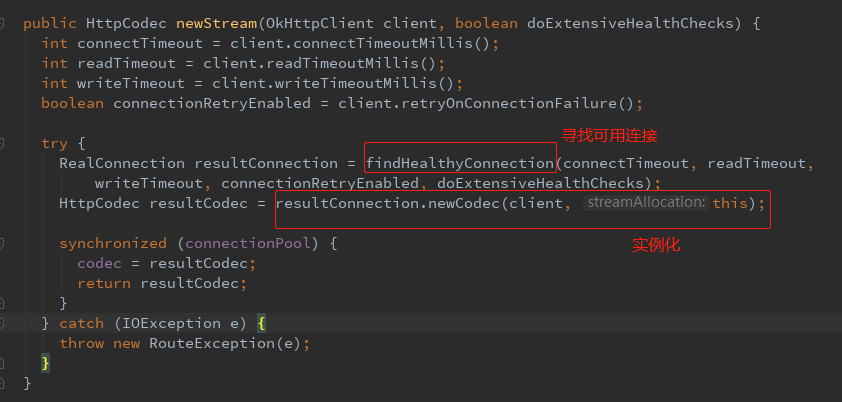   
继续跟踪寻找连接的那个方法:   
```
  private RealConnection findHealthyConnection(int connectTimeout, int readTimeout,
      int writeTimeout, boolean connectionRetryEnabled, boolean doExtensiveHealthChecks)
      throws IOException {
    while (true) {//死循环查找
      RealConnection candidate = findConnection(connectTimeout, readTimeout, writeTimeout,
          connectionRetryEnabled);

      // If this is a brand new connection, we can skip the extensive health checks.
      synchronized (connectionPool) {
        if (candidate.successCount == 0) {
          return candidate;
        }
      }

      // Do a (potentially slow) check to confirm that the pooled connection is still good. If it
      // isn't, take it out of the pool and start again.
      if (!candidate.isHealthy(doExtensiveHealthChecks)) {
        noNewStreams();
        continue;
      }

      return candidate;
    }
  }
```
整个方法是一个死循环，直到connection返回。进入到``findConnection(...)``方法里面:
```
private RealConnection findConnection(int connectTimeout, int readTimeout, int writeTimeout,
      boolean connectionRetryEnabled) throws IOException {
    Route selectedRoute;
    synchronized (connectionPool) {
      if (released) throw new IllegalStateException("released");
      if (codec != null) throw new IllegalStateException("codec != null");
      if (canceled) throw new IOException("Canceled");
      // Attempt to use an already-allocated connection.  
      RealConnection allocatedConnection = this.connection;  //优先使用已存在，未使用过的连接，直接返回此连接。
      if (allocatedConnection != null && !allocatedConnection.noNewStreams) {
        return allocatedConnection;
      }
      // Attempt to get a connection from the pool.
      Internal.instance.get(connectionPool, address, this, null);// 根据地址从连接池中寻找连接。
      if (connection != null) {
        return connection;
      }

      selectedRoute = route;
    }

    // If we need a route, make one. This is a blocking operation.
    if (selectedRoute == null) {
      selectedRoute = routeSelector.next(); //构建路由
    }
    RealConnection result;
    synchronized (connectionPool) {
      if (canceled) throw new IOException("Canceled");

      // Now that we have an IP address, make another attempt at getting a connection from the pool.
      // This could match due to connection coalescing.
      Internal.instance.get(connectionPool, address, this, selectedRoute); //根据地址，路由从连接池中寻找连接。
      if (connection != null) return connection;

      // Create a connection and assign it to this allocation immediately. This makes it possible
      // for an asynchronous cancel() to interrupt the handshake we're about to do.
      route = selectedRoute;
      refusedStreamCount = 0;
      result = new RealConnection(connectionPool, selectedRoute); //以上情况均未找到合适的连接，新创建连接。
      acquire(result); //保存配对新建连接,在这里会对connection = result 赋值。
    }

    // Do TCP + TLS handshakes. This is a blocking operation.//开始连接，金典的TCP连接握手(如果允许隧道传输则使用隧道，否则使用socket)
    result.connect(connectTimeout, readTimeout, writeTimeout, connectionRetryEnabled); 
    routeDatabase().connected(result.route());

    Socket socket = null;
    synchronized (connectionPool) {
      // Pool the connection.
      Internal.instance.put(connectionPool, result); //放入到连接池当中

      // If another multiplexed connection to the same address was created concurrently, then
      // release this connection and acquire that one.
      if (result.isMultiplexed()) {  //判断是不是http/2协议，如果是，将此connnection替换为共享的连接。
        socket = Internal.instance.deduplicate(connectionPool, address, this);
        result = connection;
      }
    }
    closeQuietly(socket);

    return result;
  }
```
概述一下：  
获取连接时优先找当前已创建的好的并且没有使用过的连接，如果找到返回该连接。如果不存在的话，根据地址(address)从连接池当中寻找，同样
如果找到返回该连接，否则构建路由地址，根据地址，路由再次从线程池中获取，获取成功返回连接。如果还没有找到则新建一个连接，保存当前的连接
`` this.connection = connection``;接着开始TCP,TLS连接(握手)，之后放入到连接池当中。方法最后有个协议的判断:
```
  if (result.isMultiplexed()) {
      socket = Internal.instance.deduplicate(connectionPool, address, this);
      result = connection;
  }
```
这个判断其实就是判断该次连接是不是http/2协议:   
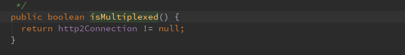   

如果满足条件则执行``Internal.instance.deduplicate(....)``,Internal 是一个抽象类，初始化是在OKHttpClient第157行(可能存在版本影响
行数并不准确)。回调的是 连接池ConnectionPool的deduplicate(...)方法(ConnectionPool类第137行):   

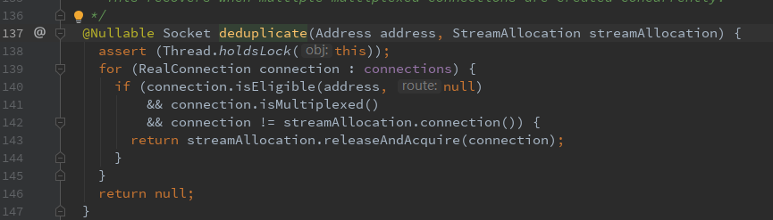  
可以看到，如果满足条件的话最终还是执行自己的``releaseAndAcquire()``方法。
```
  public Socket releaseAndAcquire(RealConnection newConnection) {
    assert (Thread.holdsLock(connectionPool));
    if (codec != null || connection.allocations.size() != 1) throw new IllegalStateException();

    // Release the old connection.
    Reference<StreamAllocation> onlyAllocation = connection.allocations.get(0);
    Socket socket = deallocate(true, false, false);

    // Acquire the new connection.
    this.connection = newConnection;
    newConnection.allocations.add(onlyAllocation);

    return socket;
  }
```
这里释放旧的连接，保存使用新的连接`` this.connection = newConnection;``。最后一直返回到findConnection()的开始调用处，也就是
在死循环内部的方法:
```
 while (true) {
      RealConnection candidate = findConnection(connectTimeout, readTimeout, writeTimeout,
          connectionRetryEnabled);

      // If this is a brand new connection, we can skip the extensive health checks.
      synchronized (connectionPool) {
        if (candidate.successCount == 0) {  //全新的连接，直接返回
          return candidate;
        }
      }
      // Do a (potentially slow) check to confirm that the pooled connection is still good. If it
      // isn't, take it out of the pool and start again.
      if (!candidate.isHealthy(doExtensiveHealthChecks)) { //做健壮性检查
        noNewStreams();
        continue;
      }
      return candidate;
    }
```
获取到连接后，对这个连接做一个做健壮性检查，如果此连接(socket)已经完全关闭(可以准备下一次连接,说明是健康的),返回这个连接，
否则循环，继续寻找连接，直到获取到符合条件的连接，返回。回到执行这些代码的初入口``streamAllocation.newStream(...)``。此刻已经获取到了
健康(可用)的Connection了。继续往下走(可以回到ConnectInterceptor拦截器部分的第一张图片代码查看完整newStream()方法内容)
```
//省略前面代码

 RealConnection resultConnection = findHealthyConnection(connectTimeout, readTimeout,
          writeTimeout, connectionRetryEnabled, doExtensiveHealthChecks);
 HttpCodec resultCodec = resultConnection.newCodec(client, this);
 
 //省略后面面代码
```
跟踪进去 ``newCodec()``:   
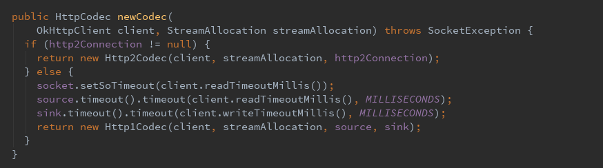   
可以看到结果就是返回Http1Codec或者Http2Codec对象。如果使用的是http/2协议，http2Connection就会被初始化，返回的就是Http2Codec对象了。
最后保存，返回。newStream()方法结束。返回到拦截器ConnectInterceptor的intercept方法里，将初始化的httpCodec、connection作为参数，进入到
下一个拦截器。

<b> CallServerInterceptor</b>  

```text
  @Override public Response intercept(Chain chain) throws IOException {
    RealInterceptorChain realChain = (RealInterceptorChain) chain;
    HttpCodec httpCodec = realChain.httpStream();
    StreamAllocation streamAllocation = realChain.streamAllocation();
    RealConnection connection = (RealConnection) realChain.connection();
    Request request = realChain.request();

    long sentRequestMillis = System.currentTimeMillis();
    //准备http报头，并且发送给服务器
    httpCodec.writeRequestHeaders(request);

    Response.Builder responseBuilder = null;
    //判断请求方式(如get，put，post等等)，get请求是没有请求体的；判断是否有请求体
    if (HttpMethod.permitsRequestBody(request.method()) && request.body() != null) {
      // If there's a "Expect: 100-continue" header on the request, wait for a "HTTP/1.1 100
      // Continue" response before transmitting the request body. If we don't get that, return what
      // we did get (such as a 4xx response) without ever transmitting the request body.
      if ("100-continue".equalsIgnoreCase(request.header("Expect"))) {
        httpCodec.flushRequest();
        responseBuilder = httpCodec.readResponseHeaders(true); //解析服务器的响应报头
      }

      if (responseBuilder == null) { // 等于null，说明服务器允许传输body，开始写入数据
        // Write the request body if the "Expect: 100-continue" expectation was met.
        Sink requestBodyOut = httpCodec.createRequestBody(request, request.body().contentLength());
        BufferedSink bufferedRequestBody = Okio.buffer(requestBodyOut);
        request.body().writeTo(bufferedRequestBody);
        bufferedRequestBody.close();
      } else if (!connection.isMultiplexed()) {
        // If the "Expect: 100-continue" expectation wasn't met, prevent the HTTP/1 connection from
        // being reused. Otherwise we're still obligated to transmit the request body to leave the
        // connection in a consistent state.
        streamAllocation.noNewStreams();
      }
    }

    httpCodec.finishRequest();

    if (responseBuilder == null) {
      responseBuilder = httpCodec.readResponseHeaders(false);
    }

    //完成数据写入，构建响应。
    Response response = responseBuilder
        .request(request)
        .handshake(streamAllocation.connection().handshake())
        .sentRequestAtMillis(sentRequestMillis)
        .receivedResponseAtMillis(System.currentTimeMillis())
        .build();

    int code = response.code();
    if (forWebSocket && code == 101) {
      // Connection is upgrading, but we need to ensure interceptors see a non-null response body.
      response = response.newBuilder()
          .body(Util.EMPTY_RESPONSE)
          .build();
    } else {
      response = response.newBuilder()
          .body(httpCodec.openResponseBody(response)) //解析服务器的响应消息
          .build();
    }

    if ("close".equalsIgnoreCase(response.request().header("Connection"))
        || "close".equalsIgnoreCase(response.header("Connection"))) {
      streamAllocation.noNewStreams();
    }
    
    //对特殊响应做其他的处理(详细可以参考各种http的状态code代表意思)
    if ((code == 204 || code == 205) && response.body().contentLength() > 0) {
      throw new ProtocolException(
          "HTTP " + code + " had non-zero Content-Length: " + response.body().contentLength());
    }

    return response;
  }
}
```

概述：   
首先准备http的请求报头，并发送给服务器，如果此次请求是有请求body的并且在请求报头包含“Expect:100-continue”的信息，则需要等待服务器的
响应(通过``httpCodec.readResponseHeaders()``解析，返回null表示允许)，确认服务器是否接受该请求。如果允许，则将请求body写入到
传输流中去，完成发送。如果被拒绝，则需要阻止连接被重用(如果是http/1.1协议)。接着开始构建响应，通过``httpCodec.openResponseBody()``解析服务
器的响应消息,封装响应体。最后返回响应。到这儿所有的拦截器都已经执行完毕(手动添加的拦截器忽略)，因为按照拦截器链(List)的添加顺序，CallServerInterceptor
就是最后一个。最后附上拦截链的一个流程图   
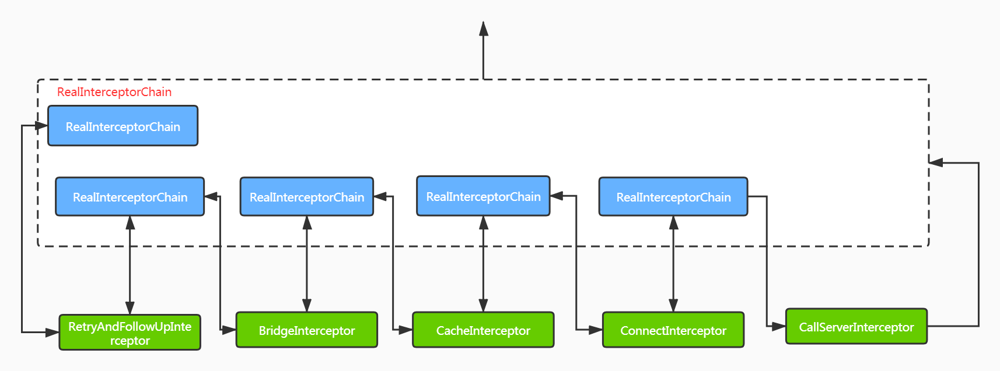  

response也已经获取到，最后返回到RealCall类的``execute()``方法里，也就最开始跟踪拦截器那里，通过Callback回调onResponse()/onFailure()
到我们的应用当中，请求结束。    
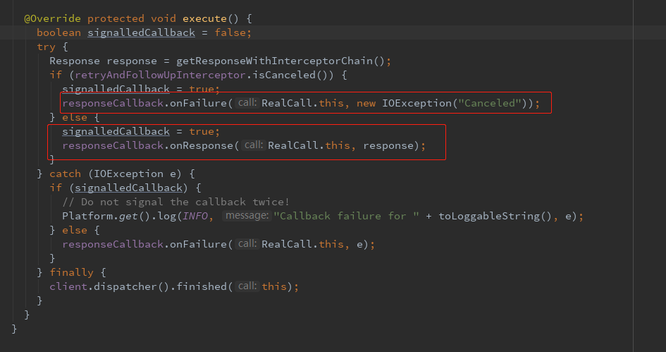


